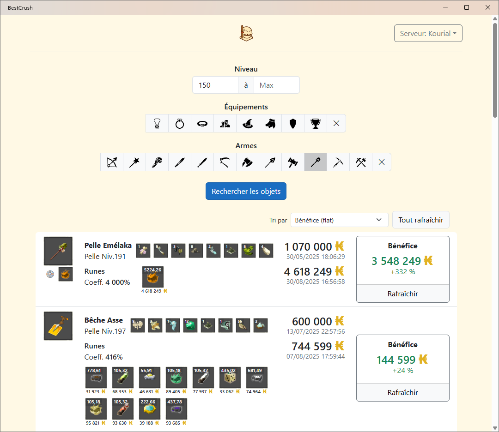

# BestCrush

BestCrush is an application designed to help players of the game Dofus find the most profitable items to crush for runes. It leverages both static game data from DofusDB and dynamic community-driven data from Dofocus to provide accurate, up-to-date recommendations.

## Features
- **Search for items** by criteria (e.g., item type, level range)
- **Fetch item stats, recipes, and rune data** from DofusDB
- **Retrieve dynamic crush coefficients and rune prices** from Dofocus
- **Simulate rune yield** for each item based on current coefficients
- **Calculate estimated benefit and yield** for crushing items
- **Sort and display results** by benefit or yield

## How It Works
1. The user specifies search criteria (e.g., swords between level 20 and 50).
2. The app fetches relevant items and their stats from DofusDB.
3. For each item, it retrieves:
   - Rune prices and crush coefficients from Dofocus
   - Item cost and recipe from DofusDB
4. It simulates the runes obtained by crushing the item, using the current coefficient.
5. The app computes the estimated benefit (profit) and yield (percentage gain).
6. Results are displayed, sortable by benefit or yield.

## Installation

Download [the latest release](https://github.com/ismailbennani/DofusSharp/releases/latest) for your platform.

## Contributing

Contributions are welcome! Please open issues or submit pull requests for bug fixes, features, or documentation improvements.

## License

This project is licensed under the terms of the [MIT License](../LICENSE.md).
